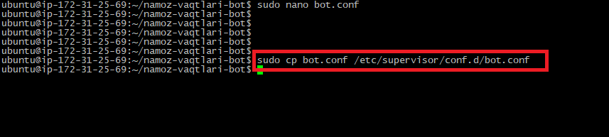

# __Reja__

- [x] Visa cart (xisobida kamida **1$**)  bo'lishi kerak

1. **Amazon**  saytidan hisob(аккаунт) yaratish
2. **Ubuntu** server olish(bepul)
3. **PuTTY** orqali serverga bog'lanish
4. **WinSCP** orqali serverga bog'lanish
5. **Loyiha** - ni yuklash va Serverni Sozlash
     - **Loyiha** - ni server uchun tayyorlash.
     - **PuTTY** va **WinSCP** orali loyihani  serverga yuklash.

# *Amazon*  saytidan profil ochish sayt manzili >>> [Amazon](https://aws.amazon.com)
> *Hisob* yaratishdan  boshlang!
 

> *Pochtangiz va hisob nomini kiriting*
 

> *Pochtangizga kelgan sms kodni kiriting!*
 

> *Hisobingiz uchun yangi parol  hosil qiling!*
 

> *Telefon raqamingiz va Shaxsiy ma'lumotlaringizni kiriting!*

 

> *Visa carta ma'lumotlaringizni kiriting!*

 

> *Telefon raqamingizni  kiriting va rasmda ko'rsatiladigan belgilarni yozing!*

 

> *Telefon raqamingizni kelgan sms kodni kiriting!*

 

> *Rasmda ko'rsatilgan Bepul qismi tanlang!*

 

> *Rasmda ko'rsatilgandek bajaring!*
 

> *Hisobingizga kirish uchun qaytadan pochtangiz va parolingizni kiriting!*
 

> *Hisobingizda rasmdagidek oyna hosil bo'lsa hammasi :+1:*
 

# **Ubuntu** server olish
> *EC2* bo'limni tanlang!
 

> *Agar sizda ham shunday oyna hosil bo'lsa kuting, 24 soatda ishga tushishi kerak odatda 1-2 soatlarda Hisobingiz tasdiqlanishi kerak agar visa cartangiz bilan muammo bo'lmasa*
 

> *Hisobingiz tasdiqlangandan so'ng qayta *EC2* bo'limni tanlang va *Launch instance* bo'limini tanlang!*
 

> *Serveringizga nom bering va **UBUNTU* - ni tanlang*
 

> *Rasmda ko'rsatilgandek bajaring va *Create new key pair* - ni tanlang!*
 

> *Kichik oyna ochiladi va Key uchun nom bering va .pem ni tanlang *E'tibor bering key yaratilishi bilan yuklab olinadi kerakli joyda saqlang faylni* - serverga ulanish uchun ishlatiladi!*

 

> *Launch instance* bo'limini tanlang!*
 

> *Kuting va hammasi :+1: >>> *View all instance*>>*
 

> *Biroz Kuting Running bo'lishini! Pastroqdagi *Public IP* - bo'limida sizngin server IP addressingiz bo'ladi*
 

# **PuTTY** - orqali serverga bog'lash! Yuklash uchun manzil >>>> [PuTTY](https://www.putty.org)
> *DAsturni o'rnatganingizda *PuTTYgen* dasturi ham o'rnatiladi va ush dastur orqali Yuklab olgan .pem Faylimizni  *Private* - qilishda foydalanamiz!
> *Conversions* - bo'limini tanlane!

 
 

> *Save Private Key*

 

> *PuTTY* - dasturiga kirib oling! Rasmda ko'rsatilgan joyga *IP* addressingizni kiriting!
 - *SSH* - bo'limiga kiring!
 
 

> *PuTTYgen dasturida Private qilib olgan faylingizni shu yerda ko'rsatishingiz kerak va *Open* bo'limi bosing!
 

> 'Terminal ochilishi va sizdan Login kiritishingizni kutadi  Ubuntu serverlariga *ubuntu* - logini kiritiladi va *Enter* - ni bosing Hammasi :+1: !
 

# **WinSCP** orqali serverga bog'lanish! Yuklash uchun manzil >>>> [WinSCP](https://winscp.net/eng/download.php)
 

> Rasmdagidek oyna ochiladi va u yerdan **Tools** bo'limini tanlang ==> **Import Sites...** menusi tanlang va sizni **PuTTY** dasturi yordamida bo'g'langan serverlar ro'yxati chiqadi!

 

> Kerakli serverni tanlab **OK** - ni bosing!

 

> Rasmdagidek oyna ochiladi va IP manzilingiz yozilganligi e'tibor bering va **Login** -bilan serverga bog'lanishni boshlang!
 

> Sizdan **username** kiritishni so'rashi mumkin **ubuntu** yozing va **OK** !

 

> Serverga bog'landik :+1:!
 - Qizil belgi bilan belgilangani bu serveringiz hisoblanadi!
 - chap tarafi esa Localniy(SHaxsiy kompyuteringiz!)
 - Loyihani papkasi bilan yoki fayllarini belgilab SERVER tarafga sichqoncha yordamida sudrab olib kelish kifoya!

 

# **PuTTY** orali loyihani serverga yuklash.
- Loyihani *GITHUB* - ga push qiling va albatta Loyiha fayllari orasida *requirements.txt* fayli bo'lishi va loyihada ishlatgan Paketlaringiz yozilganligiga  E'tibor bering!
- *PuTTY* - orqali serverga bog'laning 
- *Loyiha* - ni *GITHUB* - dan clone qiling
- *Loyiha* - *GIT* - da *Public* bo'lsa sizdan *Parol* so'ramaydi aksi bo'lsa parol so'raydi!
- *Clone* - ni qilgach *ls* komandasini bering Loyihangiz papkasni ko'rsatishi kerak! hammasi :+1:
     
 

> Serverga *pip* - ni o'rnating!
- O'rnatishni tugashi kuting!
     

> *Loyiha* - papkasiga kiring *cd*!
- *pip install requirements.txt* Paketlarni o'rnating!
     

> *Loyiha* - ni ishga tushiring!
     - Botni ishlashini tekshiring!
     

> *Loyiha* - ni Serverda *Doimiy* - ishlashi uchun qo'shimcha sozlamalarni o'rnating ya'niy *supervisor* - ni o'rnating!    

> *Loyiha* - ni ichida *touch bot.conf* yordamida yangi fayl yarating!    
     - Faylga yozish uchun *sudo nano bot.conf* komandasini bering va sizni faylga yozishingiz uchun buyruqni bajarishingiz bilan fayl ichiga yo'naltiradi!
     

> Rasmdagilarni Faylga yozing(bot.conf ichiga)!    
 - *Qizil* randagisiga belgi ichiga loyihani ishga tushirish uchun nom bering!
 - *Oq* randagisiga belgi ichiga Loyihangizni papkasini nomini yozing!
 - *Sariq* randagisiga belgi ichiga Loyihangizni ishga tushiradigan faylni nomi yozing!
 - Qolgan belgi ichidagilarni Yozish Majburiy *EMAS*
 - Yozib bo'lgach *ctrl + s* - ni bosing va *ctrl + x* - ni bosing fayl ichidan chiqing!
     

> Rasmdagilarni komandani bering!

> Loyihani doimiy ishlashi uchun rasmdagi komandalarni yozing ketma-ket!
- hammasini to'g'ri bajargan bo'lsangiz Loyiha ishga tushadi va doimiy ishlashni boshlaydi
- loyihaga o'zgartish kiritish va qayta yangilashni keyingi bosqichlarda ko'rib chiqamiz Insha'Allah
- Iltimos mehnatimiz sizga foyda berayotgan bolsa *GITHUB* profilimizga obuna bo'ling va telegram kanalimizda reaksiyalarni qoldiring :+1:

# *E'tiboringiz uchun rahmat* Savollaringiz bo'lsa [Telegram](https://t.me/foydamizteg_sin)
