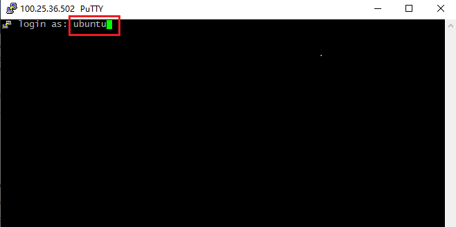

# __Reja__

- [x] Visa cart (xisobida kamida **1$**) bo'lishi kerak

1. Amazon saytidan hisob(аккаунт) yaratish
2. Ubuntu server olish(bepul)
3. PuTTY orqali serverga bog'lanish

# Amazon saytidan profil ochish sayt manzili >>> [Amazon](https://aws.amazon.com)
> *Hisob* yaratishdan boshlang!
 

> *Pochtangiz va hisob nomini kiriting*
 

> *Pochtangizga kelgan sms kodni kiriting!*
 

> *Hisobingiz uchun yangi parol hosil qiling!*
 

> *Telefon raqamingiz va Shaxsiy ma'lumotlaringizni kiriting!*

 

> *Visa carta ma'lumotlaringizni kiriting!*

 

> *Telefon raqamingizni kiriting va rasmda ko'rsatiladigan so'zlarni kiriting!*

 

> *Telefon raqamingizni kelgan sms kodni kiriting!*

 

> *Rasmda ko'rsatilgan Bepul qismi tanlang!*

 

> *Rasmda ko'rsatilgandek bajaring!*
 

> *Hisobingizga kirish uchun qaytadan pochtangiz va parolingizni kiriting!*
 

> *Hisobingizda rasmdagidek oyna hosil bo'lsa hammasi :+1:*
 

# **Ubuntu** server olish
> *EC2* bo'limni tanlang!
 

> *Agar sizda ham shunday oyna hosil bo'lsa kuting, 24 soatda ishga tushishi kerak odatda 1-2 soatlarda Hisobingiz tasdiqlanishi kerak agar visa cartangiz bilan muammo bo'lmasa*
 

> *Hisobingiz tasdiqlangandan so'ng qayta *EC2* bo'limni tanlang va *Launch instance* bo'limini tanlang!*
 

> *Serveringizga nom bering va **UBUNTU* - ni tanlang*
 

> *Rasmda ko'rsatilgandek bajaring va *Create new key pair* - ni tanlang!*
 

> *Kichik oyna ochiladi va Key uchun nom bering va .pem ni tanlang *E'tibor bering key yaratilishi bilan yuklab olinadi kerakli joyda saqlang faylni* - serverga ulanish uchun ishlatiladi!*

 

> *Launch instance* bo'limini tanlang!*
 

> *Kuting va hammasi :+1: >>> *View all instance*>>*
 

> *Biroz Kuting Running bo'lishini! Pastroqdagi *Public IP* - bo'limida sizngin server IP addressingiz bo'ladi*
 

# **PuTTY** - orqali serverga bog'lash! Yuklash uchun manzil >>>> [PuTTY](https://www.putty.org)
> *DAsturni o'rnatganingizda *PuTTYgen* dasturi ham o'rnatiladi va ush dastur orqali Yuklab olgan .pem Faylimizni  *Private* - qilishda foydalanamiz!
> *Conversions* - bo'limini tanlane!

 
 

> *Save Private Key*
 

> *PuTTY* - dasturiga kirib oling! Rasmda ko'rsatilgan joyga *IP* addressingizni kiriting!
 - *SSH* - bo'limiga kiring!
 

> *PuTTYgen dasturida Private qilib olgan faylingizni shu yerda ko'rsatishingiz kerak va *Open* bo'limi bosing!
 

> 'Terminal ochilishi va sizdan Login kiritishingizni kutadi  Ubuntu serverlariga *ubuntu* - logini kiritiladi va *Enter* - ni bosing Hammasi :+1: !
 

# *E'tiboringiz uchun rahamt* Savollaringiz bo'lsa [Telegram](https://t.me/foydamizteg_sin)
