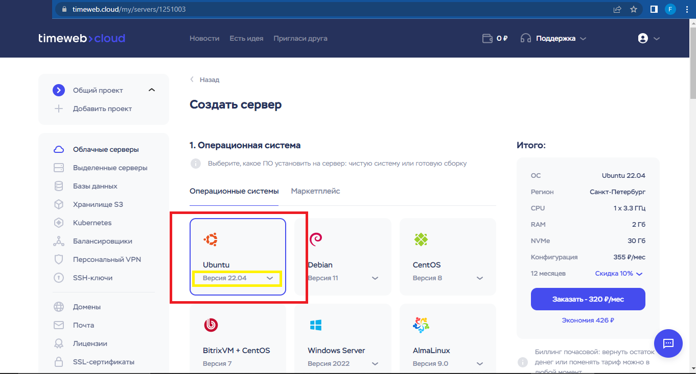
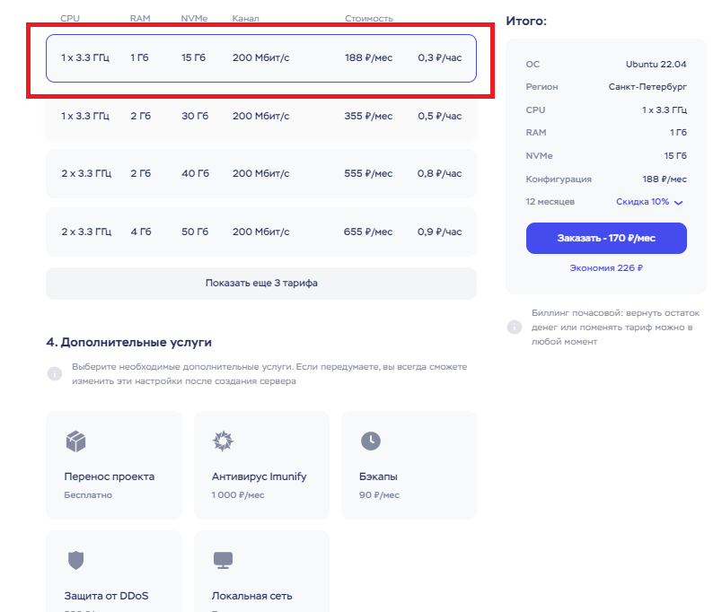
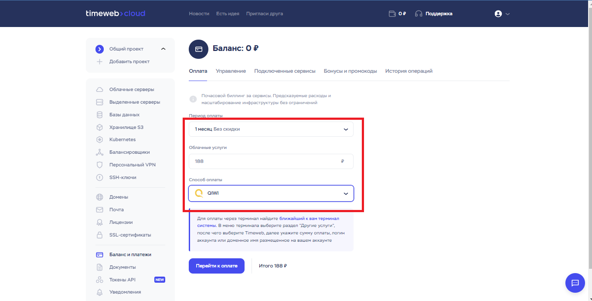
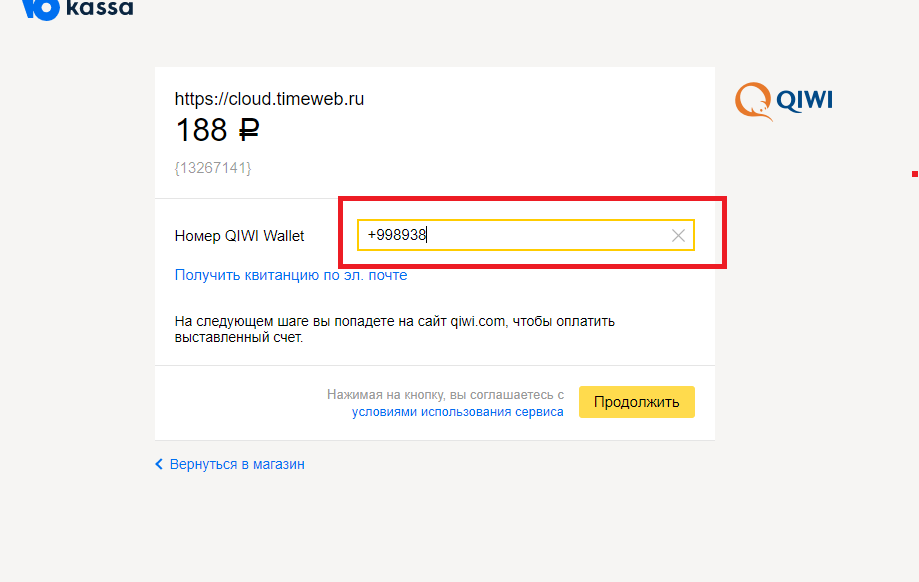
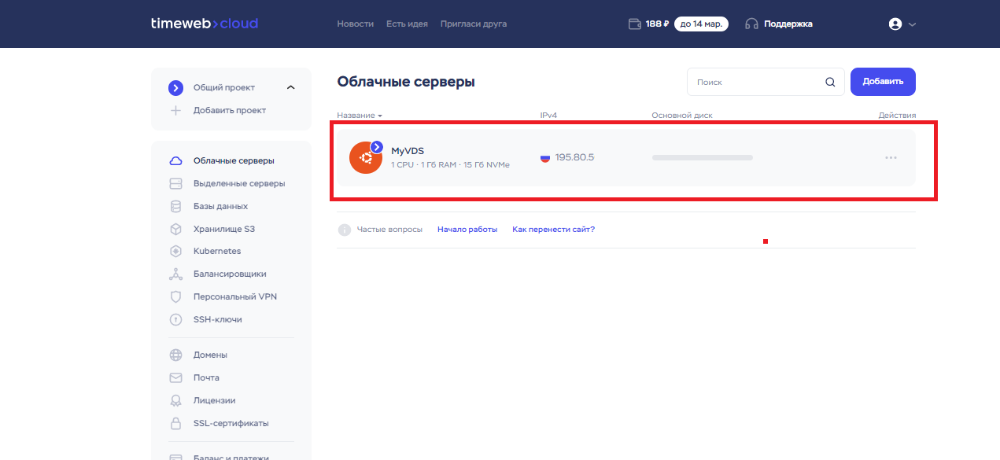
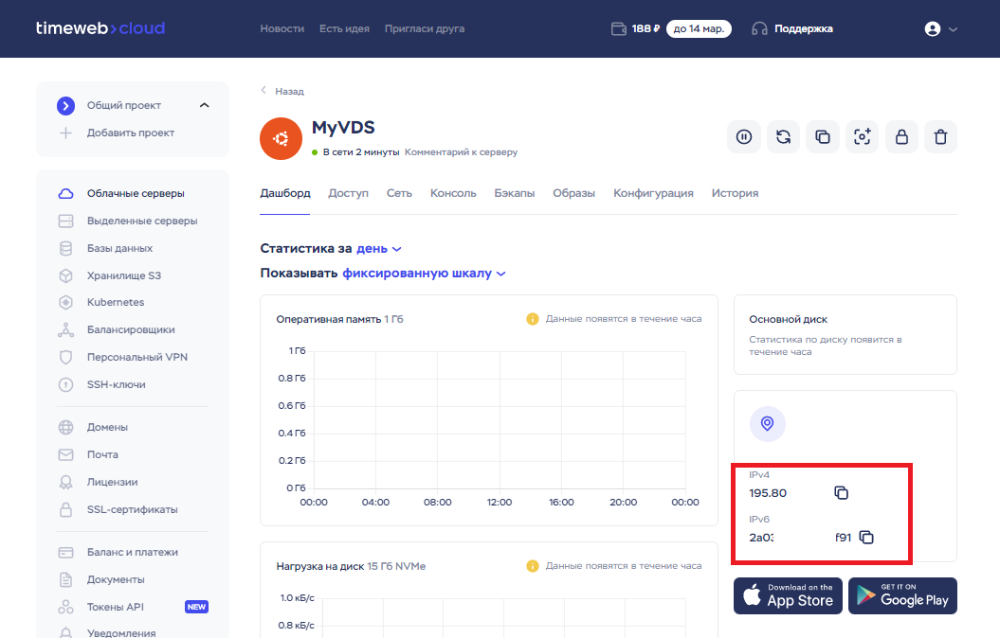
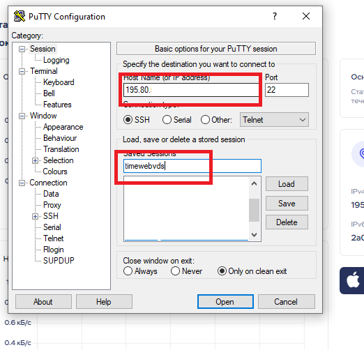
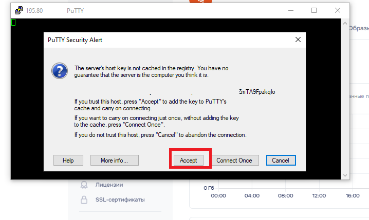
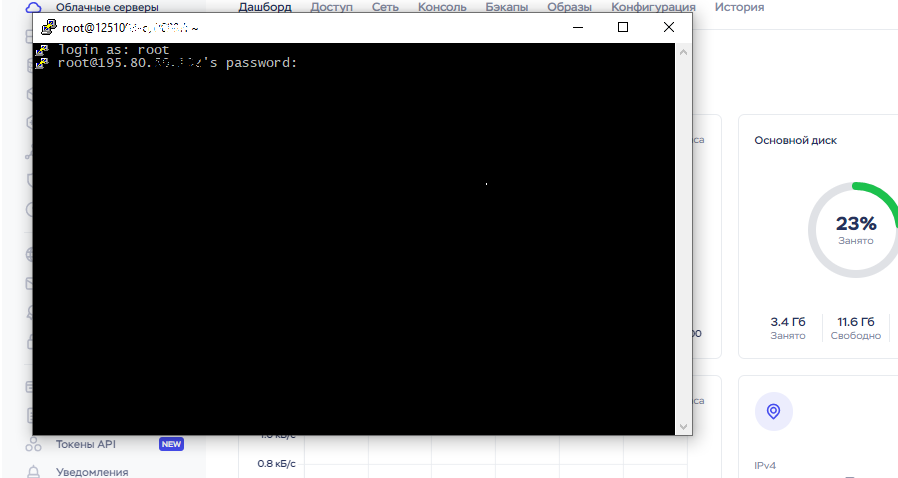

# __Reja__

- [x] [Timeweb](https://timeweb.com/) sayti orqali pullik VDS & VPS server sotib olish va unga o'z loyihalarimizni yuklashimiz mumkin!

1. **Timeweb**  saytidan hisob(аккаунт)  yaratish
2. **Timeweb**  hisobimiz(аккаунт) -ni QIWI orqali to'ldirish
3. **Ubuntu** server  olish
3. **PuTTY** orqali serverga bog'lanish
4. **WinSCP** orqali serverga  bog'lanish
5. **Loyiha** - ni yuklash va  Serverni Sozlash
     - **Loyiha** -  ni server uchun tayyorlash.
     - **PuTTY** va **WinSCP** orali loyihani  serverga yuklash.

# *Timeweb*  saytidan profil  ochish sayt manzili >>> [Timeweb](https://timeweb.com/)
> *Hisob* yaratishdan  boshlang! VDS и VPS bo'limini tanlang va ro'yxatdan o'ting!

 

> *Server yaratishni boshlang Ubuntu tanlang va albatta versiyasini Tanlang xozirda 22.04 so'nggi versiya!*
 

> *Kerakli oylik paketini tanlang! 188 rubl botlar uchun yetarli *
 

> *Rasmdagi sozlamalarni sozlang va boshqa sozlamalarni belgilasangiz qo'shimcha pul oylik tulovingizga qo'shiladi!*
 

> *Server sozlamalarini tugatishingiz bilan siz tulov qilishingiz kerak! Rasmda QIWI orqali to'lov amalga oshirilgan*
> *QIWI* dan profil ochgan bo'lishingiz kerak yoki *VISA* orqali tulovni amalga oshirishingiz ham mumkin!

 

> *QIWI profil telefon raqamingizni kiriting va Tulovni amalga amalga oshiring!*

 

> *Sotib olgan serverni ko'rishingiz mumkin*

 

> *Rasmda ko'rsatilgan joyda sizning IP manzilingiz bo'ladi kopiya oling va *PuTTY* dasturini oching

 

> *IP manzilingizni joylashtiring va serverni nomlang!*

 

# *Gmailingizga xabar yuboriladi u xabarda sizning IP manzilingiz va *Parolingiz* bo'ladi*

> *Acceptni belgilang*
 
 

> *Gmailingizdan parolni oling Login odatda __root__ bo'ladi :+1:*
 
 

# *Keyingi bosqich*
> Ubuntu serverlariga loyihani yuklash deyarli bir xil xoxlasangiz WinSCP yoki PuTTY orqali bu qismlar bilan [Amazon](https://github.com/foydamiztegsin/server-uchun/tree/main/amazon-bepul-server) manzilda tanishishingiz mumkin

# *E'tiboringiz uchun rahmat* Savollaringiz bo'lsa [Telegram](https://t.me/foydamizteg_sin)
